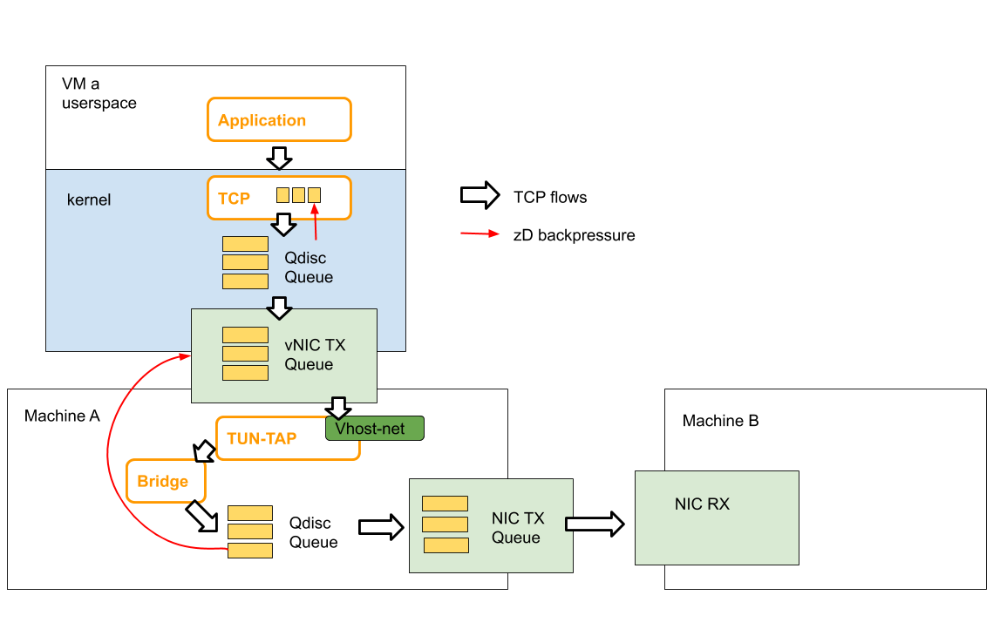

# zD: A Scalable Zero-Drop Network Stack at End Hosts
zD is a new architecture for handling congestion at end host. The key idea is to apply backpressure from scheduled buffers, which handle packets from multiple sources and schedules them according to some policy, to source buffers from which packets are dispatched. zD prevents packet drops at scheduled buffers, allowing scheduled buffers to have short queues. This combination leads to improvement in both network and CPU performance. This is achieved by preventing packet drops and their retransmission, saving on both CPU and throughput. It also reduces latency by combating buffer bloat.

We implement zD in the Linux kernel to apply back pressure from Qdiscs to packet sources under in two cases: 1) when the queues and traffic sources are within the kernel stack (i.e., in the same virtual or physical machine), and 2) when the traffic sources are in the virtual machine and the queues are in the hypervisor. Using zD requires compiling and installing our edited linux kernel found [here](https://github.com/zD-linux/linux-4.14.67).

## What motivated the work?
For years, improved chips added more cores rather than more capacity per core. From the perspective of the networking stack, this meant that rather than having to serve a few connections per machine, new networking stacks have to handle tens of thousands of connections per machine. Processing of egress traffic in such stacks relies on holding packets in a cascade of queues pending their processing and eventual scheduling to be transmitted on the wire. Congestion of scheduled queues at end hosts is typically handled by keeping the number of packets handled by the stack a multiple of the number of active flows (e.g., TSQ limits queue length to two packets per flow). We find that as the number of flows grows, this leads to either excessive packet drops when shallow buffered queues are employed, or buffer bloat when deep buffers are allowed. We find that zD can remedy this problem by applying back pressure that is independent of the number of active flows.

## System Requirements
This code was tested on two Intel Xeon CPU E5-1620 machines, connected with a 10Gbps link. Both machines have four cores, with CPU frequency fixed to 3.6GHz. To ensure accurate performance characterization, the used kernel has minimal functionalities enabled.

## Getting started
### Experiment setting:
Physical machine A hosts a VM that generates large number of flows and send them to physical machine B. Users can choose to use zD only on VM a or use zD on both VM a and physical machine A.

The figure below shows the detailed queuing architecture of our experiment setting. 



### Configure Machine A (The Sender)
1. Install OS for hypervisor. We are using Ubuntu 14.04 for our experiment.

2. Install and configure the hypervisor. Note: we use QEMU v. 2.12: https://download.qemu.org/ for our experiment. While zD is not dependent on hypervisor, the configuration script we provide to configure and start the VM is only tested with QEMU v.2.12.

3. Fetch and install your hypervisor kernel. The baseline we are comparing with is kernel version 4.14.67. For zD, we provide two versions, one with tbf implemented (physical-tbf) and another with pfifo implemented (physical-pfifo).
    ```
    git clone --single-branch --branch physical-pfifo https://github.com/zD-linux/linux-4.14.67.git
    ```
    Configure linux kernel features and compile the kernel:
    ```
    cd linux-4.14.67
    nconfig
    make -j 16
    ```
    copy the compiled kernel image to /boot (or other directory according to the grub configuration).
        
    Note: here's the .config file we use https://github.com/zD-linux/zD-configuration/tree/master/kernel-config. We only turned on necessary modules to reduce the compilation time and optimize the networking stack performance. Person compiling the code should take care of changing other parameters according to their hardware configurations. 
    
4. Install OS for VM. We are using Alpine linux 3.8 (https://www.alpinelinux.org/) for our experiment because it is a lightweight linux distribution. Our goal is to monitor networking stack so it is better to have an OS with limited features.   
  
5. Fetch and compile kernel for VM. The baseline we are comparing with is kernel version 4.14.67. For zD, we provide two versions, one with tbf implemented (vm-tbf) and another with pfifo implemented (vm-pfifo).
    ```
    git clone --single-branch --branch vm-pfifo https://github.com/zD-linux/linux-4.14.67.git
    ```
    Configure linux kernel features and compile the kernel:
    ```
    cd linux-4.14.67
    nconfig
    make -j 16
    ```

6. start the VM and change the networking configuration. You should be able to ping machine B from VM after this step.
    ```
    qemu-system-x86_64      -m 10240 -smp 6 -no-acpi                                                                                                \
                        -enable-kvm     -snapshot                                                                                       \
                        -nographic -serial mon:stdio                                                                            \
                        -kernel <*path to the compiled kernel*>                                                                            \
                        -append "root=/dev/vda3 console=ttyS0"                                                                  \
                        -drive file=<*path to the VM image*>,if=none,id=disk0,format=qcow2,cache=none                                                 \
                        -device virtio-blk-pci,scsi=off,bus=pci.0,addr=0x4,drive=disk0,id=disk0,bootindex=1                     \
                        -netdev tap,id=foo,ifname=tapfoo,vhost=on                                       \
                        -device virtio-net,netdev=foo,mac=54:52:00:00:00:02                                                                             \
                        -monitor telnet::22222,server,nowait
    ```
    Configure the VM IP address so it is in the same subnet as machine B. Set up the bridge on machine A so the VM can      access the outwide network. 
    ```
    brctl addbr br-zd
    ifconfig br-zd <ip address assgiend to machine A> netmask 255.255.255.0 up
    brctl addif br-zd tapfoo
    brctl addif br-bptest <interface connected with machine B>
    ```
       
### Configure Machine B (Receiver)

1. Download and install neper. neper is a Linux networking performance tool. https://github.com/google/neper.git. Please folow the instruction to compile neper from the source code.

        

### Sample experiment
1. configurre kernel for a large number of flows
    ```
    ulimit -n 1000000
    ```
2. Script to start neper at receiver
    ```
    cd ./neper
    ./tcp_stream -F 4000 -T 20
    ```
3. Start monitoring at the sender
    monitor CPU:
    ```
    /* use dstat to monitor total cpu usage (user level and sys level)
    apt-get install dstat
    dstat -C
    ```
    monitor number of retransmission
    ```
    netstat -s | grep retrans
    ```
    monitor throughput: neper will report the total throughput
    
    monitor latency: tcpdump
    ```
    /* capture packets */
    tcpdump -i <interface> host <host IP> -B 10000000 -s 68 -w <pcap file>
    
    /* save rtt info to file */
    tshark -r <pcap file> -Y "tcp.analysis.ack_rtt and ip.dst==<src IP>" -e tcp.analysis.ack_rtt -T fields -E separator=, -E quote=d > <FILE NAME>

    /* save packet size to file */
    tshark -r <pcap file> -Y "tcp.len and ip.dst==<dst IP>" -e tcp.len -T fields -E separator=, -E quote=d > <FILE NAME>

    ```

4. Script to run neper at sender
    ```
    cd ./neper
    ./tcp_stream -c -H 192.168.4.200 -F 10000 -T 20 -B 1024 -l 200
    ```

## Contact
For questions/comments please email yzhao389 at gatech dot edu
